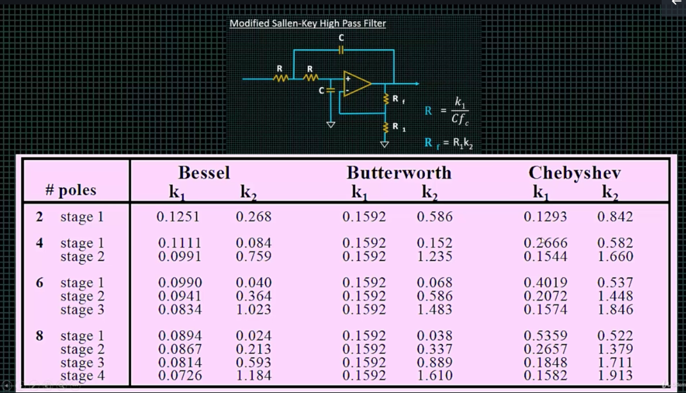
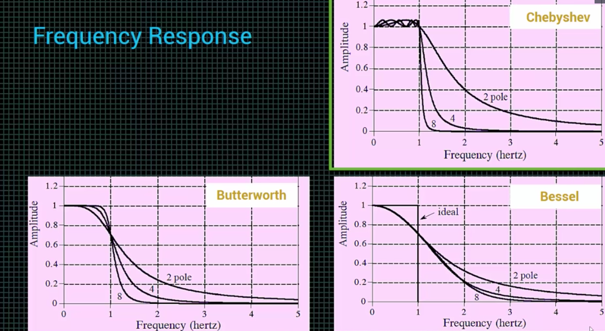
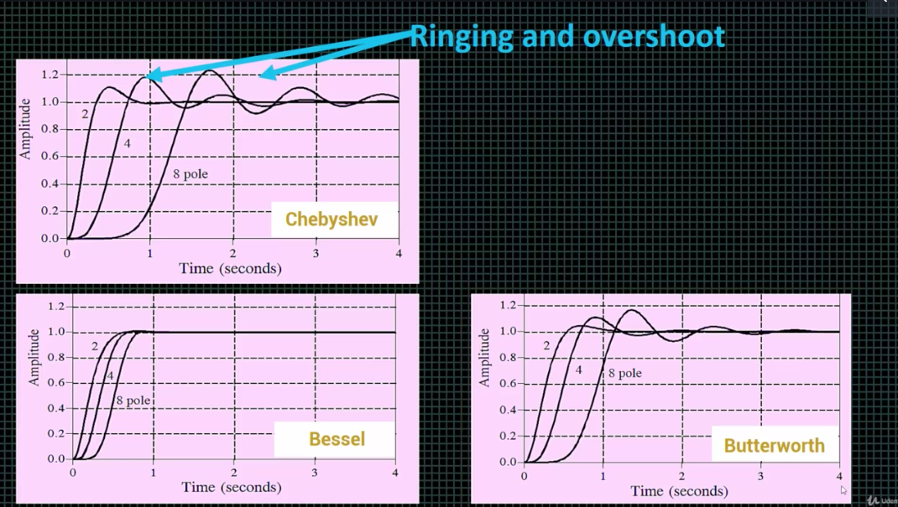
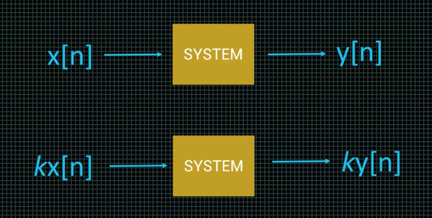
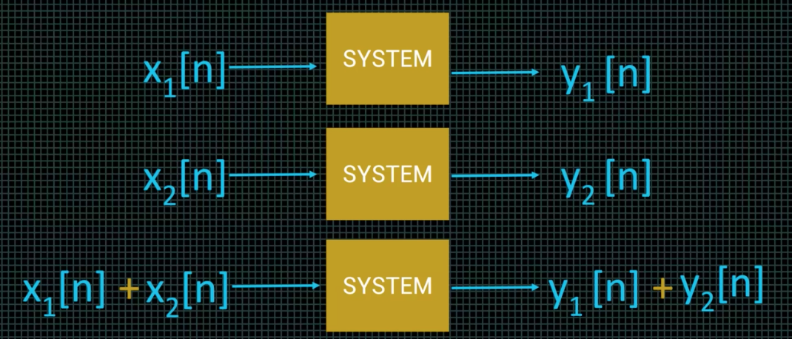
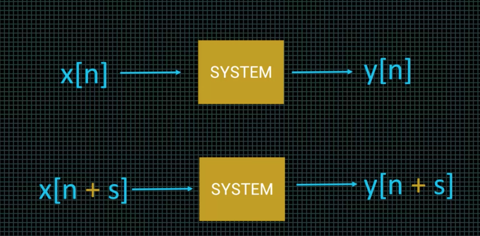
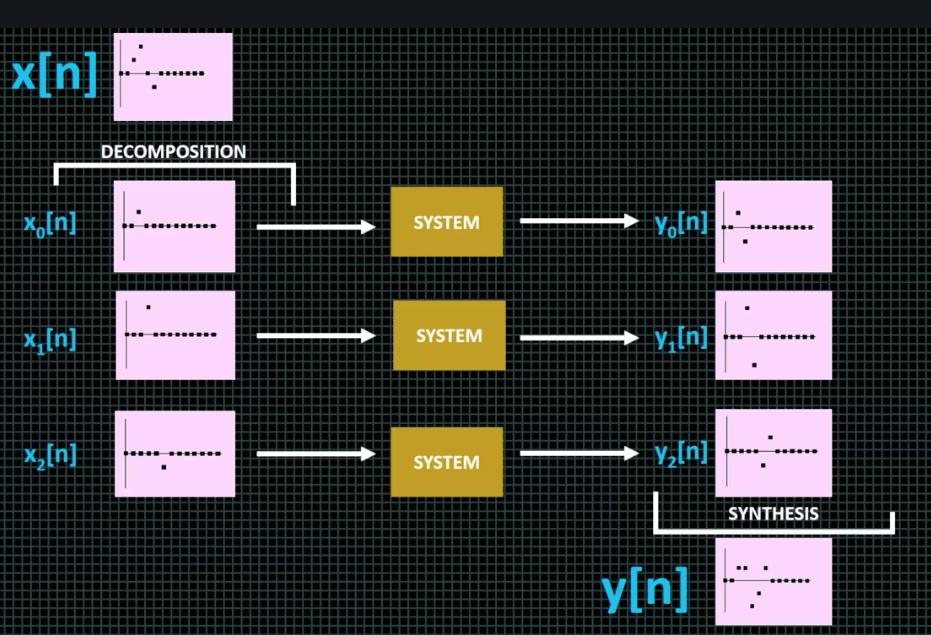
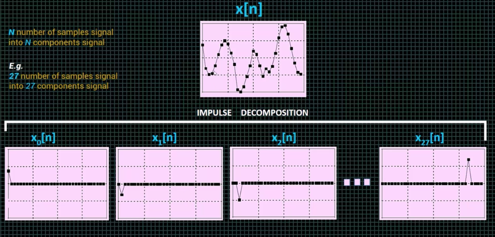
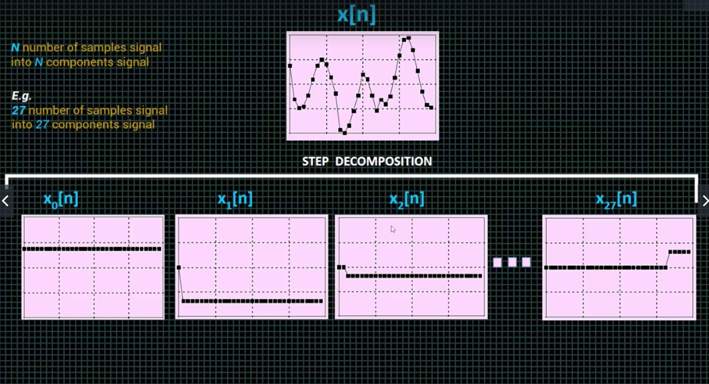

## Nyquist Theorem

```math
fsampling >= 2 * fmax
```

## Filter Terminology
* Stopband - Frequencies *NOT* allowed to pass.
* Passband - Frequencies allowed to pass.
* Roll-off - Drop in amplitude.
* Step Response - Filter response to rapid input value chjange.

## Information Encoding
* Frequency domain - Information is encoded in *sine* waves of signal.
* Time domain - Information is encoded in shape of waveform.

## Filter Design and Analysis Tools

* **[Okawa Electric Design](http://sim.okawa-denshi.jp/en/Fkeisan.htm)**

## Modified Sallen-Key High Pass Filter k1, k2 of

  * Bessel
  * Butterworth and
  * Chebyshev

****

## Frequency Response of 
* Bessel, 
* Butterworth, and 
* Chebyshev Filter

****

## Step Response of 
* Bessel, 
* Butterworth,
* Chebyshev,

****

## Signal and System
* Signal - How one parameter varies with another
* System - *Output* and *Input* relation.

* Continuous signal: x(t), y(t)
* Discrete signal: x[t], y[t]


## Linear Systems
* Homogeneity
* Additivity
* Shift Invariance

## Homogeneity
****

## Additivity
****

## Shift Invariance
****

## Synthesis & Decomposition

* Synthesis - Combining signals through scaling and addition.
* Decomposition - Breaking a signal into additive components.
### System Overview
****
### Impulse Decomposition
****
### Stemp Decomposition
****


## Convolution
